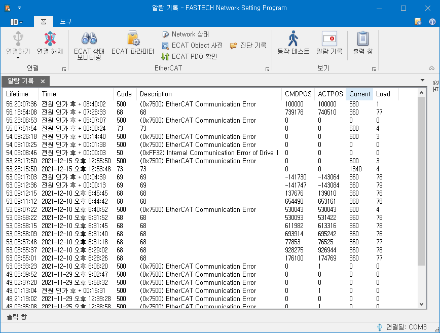

# 알람 기록

{width=600}

알람 기록에서 제품에서 지금까지 발생했던 알람들의 기록을 확인할 수 있습니다.

| Column   | 설명                                                        |
| -------- | ----------------------------------------------------------- |
| Lifetime | 알람이 발생하였을 때 Lifetime 값입니다.                     |
| Alarm    | 발생한 알람의 번호입니다.                                   |
| Detail   | 알람의 이름입니다.                                          |
| PowerOn  | 제품에 전원이 인가되고 알람이 발생하기까지 경과 시간입니다. |
| CMDPOS   | 알람이 발생하였을 때의 지령 위치값입니다.                   |
| ACTPOS   | 알람이 발생하였을 때의 엔코더 위치값입니다.                 |
| Status   | 알람이 발생하였을 때의 내부 상태 정보입니다.                |
| Current  | 알람이 발생하였을 때, 모터에 입력되고 있던 전류 정보입니다. |
| Load     | 알람이 발생하였을 때, 모터에 가해지던 부하율[%] 정보입니다. |

Lifetime과 PowerOn의 값은 시간 단위이며 [날짜].[시]:[분]:[초]의 형식으로 표시됩니다.

팝업 메뉴의 모두 삭제하기를 통해 현재 에러 기록을 모두 삭제할 수 있습니다.
