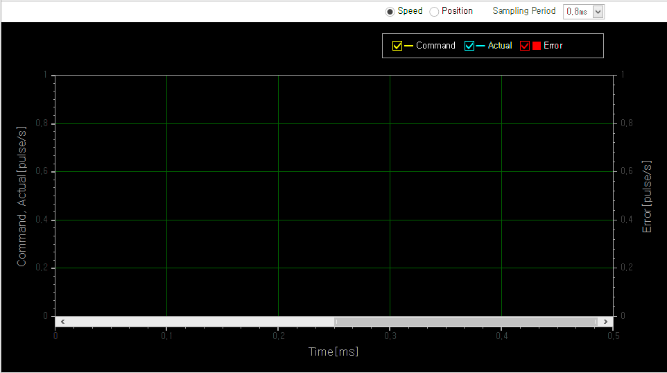

# 오토튜닝

{width=400}

오토튜닝을 수행하고 결과 확인 및 저장을 할 수 있습니다.

통신방식과 설정한 간격에 따라 결과 그래프 데이터 버퍼 오버플로가 발생할 수 있습니다.
이는 오토튜닝 동작과는 무관하며, 오토튜닝은 정상적으로 수행됩니다.
그래프 표현에만 오류가 발생합니다.

## 유의  사항

{align=right width=300}

오토튜닝 창을 열면, 제일 먼저 표시되는 내용입니다.
해당 내용을 읽고, 사용자 동의를 체크한 후 확인 버튼을 눌러 오토튜닝 화면으로 이동할 수 있습니다.

| 항목             | 설명                                                                                                   |
| ---------------- | ------------------------------------------------------------------------------------------------------ |
| 유의사항         | 오토튜닝 사용을 위한 유의사항에 대한 내용입니다.                                                       |
| 사용 불가 메시지 | 드라이브 알람 등의 이유로 오토튜닝을 사용할 수 없을 때 표시됩니다.   드라이브 상태를 확인해 주세요. |
| 사용자 동의      | 오토튜닝 사용의 유의사항을 읽고, 체크해 주세요.                                                        |
| 확인 버튼        | 오토튜닝 화면으로 넘어갑니다.                                                                          |

## 오토튜닝 메뉴

|                  ICON                  | 이름        | 설명                                                                                                                                                                                                                                                                                                                                                     |
| :------------------------------------: | ----------- | -------------------------------------------------------------------------------------------------------------------------------------------------------------------------------------------------------------------------------------------------------------------------------------------------------------------------------------------------------- |
|  | ON          | 오토튜닝 기능을 Enable 합니다.                                                                                                                                                                                                                                                                                                                           |
|         | OFF         | 오토튜닝 기능을 Disable 합니다.                                                                                                                                                                                                                                                                                                                          |
|        | Alarm Reset | 알람을 리셋합니다.                                                                                                                                                                                                                                                                                                                                       |
|           | Stop        | 오토튜닝 동작을 정지합니다.                                                                                                                                                                                                                                                                                                                              |
|         | Reset       | Tuning 이전 상태의 값(Inertia, gain)으로 초기화 합니다.                                                                                                                                                                                                                                                                                                  |
|    | Rollback    | Tuning 전의 상태로 원복합니다.                                                                                                                                                                                                                                                                                                                           |
|       | Save        | Tuning 결과를 적용하고 Flash에 저장합니다.                                                                                                                                                                                                                                                                                                               |
|         | Import      | 오토튜닝 설정값과 결과값을 파일에서 읽어옵니다.  Result값은 Manual 체크되어 있으면 Inertia Ratio, Controller Bandwidth를 읽고, 체크되어 있지 않으면 Position Kp, Velocity Kp, Velocity Ki를 읽어옵니다.  파일을 통해 읽어온 데이터 들은 Flash에 저장되지 않은 상태입니다. 해당 값들을 유지하기 원할 경우에는 Save 버튼을 눌러 저장하시기 바랍니다. |  |
|           | Export      | 오토튜닝 설정값과 결과값을 파일에 저장합니다.                                                                                                                                                                                                                                                                                                            |
|        | Exit        | 오토튜닝 창을 닫습니다.                                                                                                                                                                                                                                                                                                                                  |

## Graph

{align=right width=400}

오토튜닝 진행 결과를 그래프로 표시합니다. 

통신 방식과 Sampling Period 설정에 따라 그래프 데이터 수집 중 Overflow가 발생할 수 있습니다.
그래프 데이터 수집은 오토튜닝 동작과 별개로 이루어 지며, Overflow가 발생하여 그래프가 정상적으로 표시되지 않아도 오토튜닝 동작은 정상적으로 수행됩니다. 

| 항목                       | 설명                                         |
| -------------------------- | -------------------------------------------- |
| Speed                      | Speed 그래프를 표시합니다.                   |
| Position                   | Position 그래프를 표시합니다.                |
| Sampling Period            | 그래프 샘플링 간격을 설정합니다.             |
| Command Actual Error | 그래프에 해당 데이터 표시 여부를 설정합니다. |

## Auto-Tuning

{align=right width=300}

오토튜닝 실행을 위한 설정을 합니다.
오토튜닝 실행 후 결과는 Result에서 확인할 수 있습니다.

| 항목                  | 설명                                     |
| --------------------- | ---------------------------------------- |
| Inertia Ratio         | Inertia ratio를 설정합니다.              |
| Controller Bandwidth  | Controller bandwidth를 설정합니다.       |
| Inc Pos[pulse]        | Tuning 중 움직일 목표 위치를 설정합니다. |
| Speed[Pulse/s]        | Tuning 속도를 설정합니다.                |
| Acc/Dec[ms]           | Tuning 가/감속 시간을 설합니다.          |
| [ ]Inertia Estimation | 시작 시 Inertia Estimation을 수행합니다. |
| [ ] Gain Tuning       | Gain tuning을 수행합니다.                |
| Start/Stop 버튼       | Tuning을 시작 혹은 종료합니다.           |
| Hold/Resume 버튼      | Tuning을 일시 정지 혹은 계속 합니다.     |

## Result

{align=right width=300}

오토튜닝 실행 결과를 확인 하거나 사용자가 (Manaul 체크 시)수동으로 입력할 수 있습니다. 

결과는 전원이 차단되면 사라집니다. 해당 데이터를 유지하려면 Save를 해주세요

| 항목          | 설명                                                    |
| ------------- | ------------------------------------------------------- |
| Inertia Ratio | Auto-tuning의 Inertia Ratio 와 같은 데이터입니다.       |
| Position Kp   | Position Kp입니다.                                      |
| Velocity Kp   | Veloticy Kp입니다.                                      |
| Velocity Ki   | Velocity Ki입니다.                                      |
| [ ]Manual     | 체크시 사용자가 수동입력을 할 수 있습니다.              |
| Reset 버튼    | Tuning 이전 상태의 값(Inertia, gain)으로 초기화 합니다. |
| Rollback 버튼 | Tuning 전의 상태로 원복합니다.                          |
| Save 버튼     | Tuning 결과를 적용하고 Flash에 저장합니다.              |

## TEST RUN

{align=right}

오토튜닝 실행 결과를 확인하기 위한 기능입니다. 실행 후 결과를 그래프로 확인할 수 있습니다.  

| 항목           | 설명                                        |
| -------------- | ------------------------------------------- |
| Inc Pos[pulse] | 테스트 런 중 움직을 목표 위치를 설정합니다. |
| Speed[pulse/s] | 테스트 런 속도를 설정합니다.                |
| Acc/Dec[ms]    | 테스트 런 가/감속 시간을 설정합니다.        |
| Start          | 테스트 런 을 시작합니다.                    |

## 간단 사용 설명서

{width=500}

다음은 오토튜닝을 하는 간단한 조작 방법에 대한 설명입니다.

- [1] 버튼으로 오토튜닝 기능을 활성화 합니다.
- [2] 에서 필요한 경우 튜닝관련 설정을 합니다.
- [3] 버튼으로 튜닝을 시작합니다.
- 튜닝이 완료되면, [2]의 Result 창과 그래프를 확인 합니다.
- Test Run을 실행하여 오토튜닝 결과를 확인할 수 있습니다.
- [4]에서 Test Run 설정을 합니다.
- [5] 버튼으로 Test Run을 시작합니다.
- 오토튜닝 결과를 (전원차단 후에도) 계속 유지하고 싶으면, [6]Save를 합니다.

