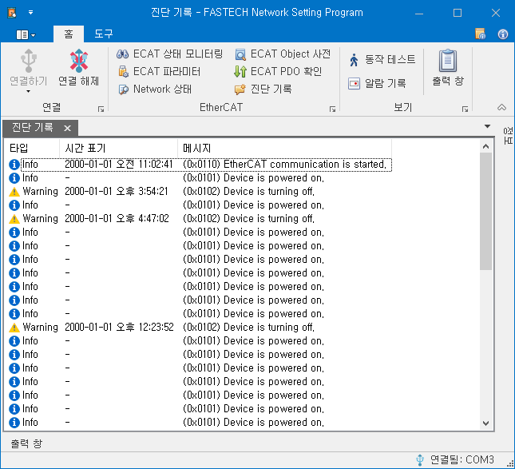

# 진단 기록

{width=500}

진단 기록 화면에서 제품에서 발생한 중요 Event 들을 확인할 수 있습니다.

| Column    | 설명                                                                                                                                                                                   |
| --------- | -------------------------------------------------------------------------------------------------------------------------------------------------------------------------------------- |
| 타입      | 발생한 Event 들의 종류를 가리킵니다.   Infor / Warning / Error 가 있습니다.                                                                                                         |
| 시간 표기 | 해당 Event 가 발생한 시간을 표시합니다.   이 시간 정보는 EtherCAT Master 를 통해 전달받습니다.   EtherCAT 통신이 이뤄지기전에 발생한 Event 에 대해서는 시간이 표시되지 않습니다. |
| 메시지    | 발생한 Event 의 종류를 가리킵니다.                                                                                                                                                     |