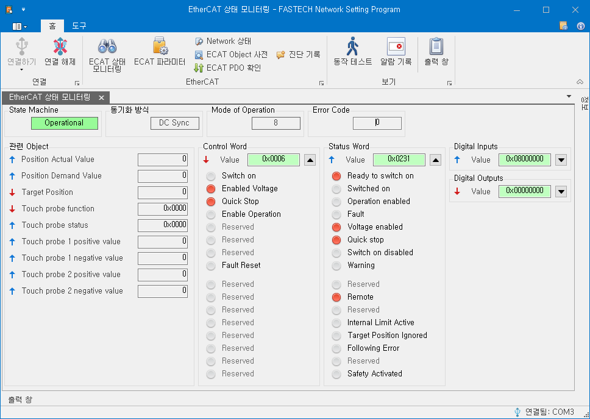
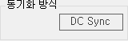
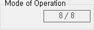
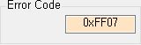
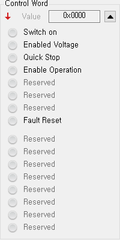
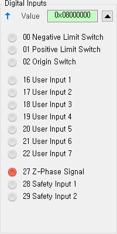
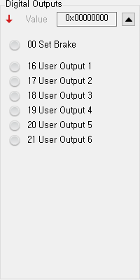

# EtherCAT 상태 모니터링

{width=600}

EtherCAT 상태 모니터링 화면에서는 실시간으로 제품의 EtherCAT 통신 상태와 EtherCAT Master와 주고 받는 Object들의 값을 확인할 수 있습니다.

EtherCAT 통신 상태(State Machine)에 따라 일부 Object 값이 갱신되지 않고 이전 데이터를 표시할 수 있음을 주의하시기 바랍니다.

## State Machine

{align=right}

현재 제품의 EtherCAT State Machine(EtherCAT 통신의 상태)을 표시하며 INIT, PRE-OP, SAFE-OP, OP, BOOT 단계가 있습니다.

EtherCAT 상태 모니터링 화면에서 표시되는 Object들의 값은 EtherCAT Master와의 통신을 통해 갱신됩니다. 통신 상태에 따라 일부 Object들의 값이 갱신되지 않아 현재 값이 아닌 이전 값을 표시할 수 있습니다.

| 단계    | 상태를 표시하는 Object | master에서 전달되는 Object |
| ------- | ---------------------- | -------------------------- |
| BOOT    | -                      | -                          |
| INIT    | -                      | -                          |
| PRE-OP  | -                      | -                          |
| SAFE-OP | 현재 상태 값을 표시함. | -                          |
| OP      | 현재 상태 값을 표시함. | 현재 명령 값을 표시함.     |

통신 상태와 상관없이 제품의 현재 상태를 확인하고 싶을 경우에는 동작 테스트 화면을 참고하시기 바랍니다.

## Sync Type (동기화 방식)

{align=right}

현재 제품의 활성화된 동기화 방식을 표시합니다. EtherCAT 통신 상태(State Machine)가 SAFE-OP 혹은 OP 상태에서 값이 표시됩니다.

## Mode of Operation

{align=right}

현재 제품의 동작 모드인 Modes of Operation(Object Index 0x6060)과 Modes of Operation Display(Object Index 0x6061)을 표시합니다. 앞의 숫자는 Modes of Operation(Object Index 0x6060)을 가리키며, 뒤의 숫자는 Modes of Operation Display(Object Index 0x6061)을 가리킵니다. Modes of Operation(Object Index 0x6060)는 EtherCAT Master에서 전달되는 Object이며, Modes of Operation Display(Object Index 0x6061)는 제품의 현재 동작 모드를 표시하는 Object입니다.

Ezi-SERVOII EtherCAT 제품이 지원하는 동작 모드는 다음과 같습니다.

| 값  | 동작 모드                        |
| --- | -------------------------------- |
| 1   | Profile Position Mode            |
| 6   | Homing Mode                      |
| 8   | Cyclic Synchronous Position Mode |

## Error Code

{align=right}

현재 제품의 Error Code (Object Index 0x603F)의 값을 표시합니다. Error Code (Object Index 0x603F)는 현재 상태를 표시하는 Object입니다. 통신 상태 (State Machine)가 SAFE-OP 혹은 OP 상태에서만 갱신합니다.

Error Code는 EtherCAT 상태 모니터링 화면에 표시되는 Error Code (Object Index 0x603F)의 값을 의미합니다.

알람 번호는 알람 기록 창에 표시되는 Alarm 값과 동작 테스트 창에 알람 타입 값을 의미합니다.

## Related Objects (관련 Object)

현재 제품이 동작하는 모드(Modes of Operation Display)에서 사용되는 Object들의 현재 값들을 표시합니다. Object 이름 앞에 표시된 화살표 표시를 통해 명령 혹은 상태 Object임을 확인할 수 있습니다.

| 표시                      | 설명                                                        |
| ------------------------- | ----------------------------------------------------------- |
|    | Master로 전달하는 제품의 현재 상태를 표시하는 Object입니다. |
|  | Master에서 Device로 전달되는 Object입니다.                  |

통신 상태(State Machine)에 따라 일부 Object의 값이 갱신되지 않을 수 있습니다. 갱신되지 않는 Object들은 이름이 회색으로 표시됩니다.

Related Objects에 표시되는 Object 목록과 실시간으로 EtherCAT Master와 PDO 통신으로 주고 받는 Object 목록과는 다를 수 있습니다. PDO 통신을 통해 주고 받는 Object 목록에 대해서는 EtherCAT PDO 확인 창을 통해 확인할 수 있습니다.

## Control Word

{align=right}

EtherCAT Master 에서 전달되는 Control Word (Object Index 0x6040)의 값을 표시합니다. 
오른쪽의 화살표를 클릭하여 창을 확대/축소할 수 있습니다. 
창을 확대하였을 때, 왼쪽의 동그라미는 해당 bit 의 상태를 표시하며, 오른쪽의 글자는 해당 bit 의 이름입니다.

Control Word 는 EtherCAT Master 가 전송하는 명령 Object 입니다. 
통신 상태(State Machine)이 OP 일 때 전달됩니다. 통신 상태(State Machine)가 OP 가 아닐 경우, 값은 갱신되지 않으며 Value 글자가 회색으로 표시됩니다.

Control Word 의 각 Bit 별 기능은 현재 동작 모드 (Modes of Operation Display)에 따라 다릅니다.
공통되는 Bit 들의 목록은 다음과 같습니다.

| Bit    | 이름             |
| ------ | ---------------- |
| 0      | Switch On        |
| 1      | Enable Voltage   |
| 2      | Quick Stop       |
| 3      | Enable Operation |
| 4 ~ 6  |                  |
| 7      | Fault Reset      |
| 8 ~ 15 |                  |

Control Word 의 각 Bit 상태에 따른 명령의 종류는 다음과 같습니다.

| Bit 6 | Bit 5 | Bit 3 | Bit 2 | Bit 1 | Bit 0 | 명령                   | 설명                   |
| ----- | ----- | ----- | ----- | ----- | ----- | ---------------------- | ---------------------- |
| 0     | x     | 0     | 0     | 0     | 0     | Not ready to switch on | SERVO OFF 상태입니다.  |
| 1     | x     | 0     | 0     | 0     | 0     | Switch on disabled     | SERVO OFF 상태입니다.  |
| 0     | 1     | 0     | 0     | 0     | 1     | Ready to switch on     | SERVO OFF 상태입니다.  |
| 0     | 1     | 0     | 0     | 1     | 1     | Switched on            | SERVO OFF 상태입니다.  |
| 0     | 1     | 0     | 1     | 1     | 1     | Operation enabled      | SERVO ON 상태입니다.   |
| 0     | 0     | 0     | 1     | 1     | 1     | Quick stop active      | 급정지 상태입니다.     |
| 0     | x     | 1     | 1     | 1     | 1     | Fault reaction active  | 알람이 감지되었습니다. |
| 0     | x     | 1     | 0     | 0     | 0     | Fault                  | 알람 상태입니다.       |

자세한 사항은 제품 사용자 매뉴얼의 4.1 드라이브의 상태 제어를 참조하시기 바랍니다.

## Digital Inputs

{align=right}

제품이 보내고 있는 Digital Inputs (Object Index 0x60FD)의 값을 표시합니다.
오른쪽의 화살표를 클릭하여 창을 확대/축소할 수 있습니다. 
창을 확대하였을 때, 왼쪽의 동그라미는 해당 bit 의 상태, 가운데의 숫자는 bit 의 번호, 오른쪽의 글자는 해당 bit 의 이름입니다.

Digital Inputs 는 제품에서 EtherCAT Master 로 전송되는 상태 Object 입니다.
통신 상태(State Machine)가 SAFE-OP 혹은 OP 인 경우에 현재 상태를 EtherCAT Master 로 전달합니다. 
그 외의 경우에는 값은 갱신되지 않으며 Value 글자가 회색으로 표시됩니다.

## Digital Outputs

{align=right}

제품이 받고 있는 Physical Outputs (Object Index 0x60FE, Sub-index 1)의 값을 표시합니다. 
오른쪽의 화살표를 클릭하여 창을 확대/축소할 수 있습니다. 
창을 확대하였을 때, 왼쪽의 동그라미는 해당 bit 의 상태, 가운데의 숫자는 bit 의 번호, 오른쪽의 글자는 해당 bit 의 이름입니다.

Digital Outputs 는 EtherCAT Master 가 전송하는 명령 Object 입니다. 
통신 상태(State Machine)이 OP 일 때 전달됩니다. 
통신 상태(State Machine)가 OP 가 아닐 경우, 값은 갱신되지 않으며 Value 글자가 회색으로 표시됩니다.
