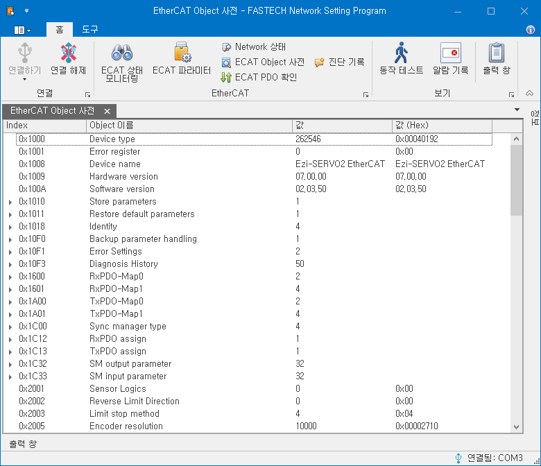

# EtherCAT Object 사전

{width=600}

EtherCAT OBJECT 사전 화면에서 제품이 가지고 있는 Object 목록을 확인할 수 있습니다.

| Column      | 설명                                      |
| ----------- | ----------------------------------------- |
| Index       | 해당 Object 의 Index 를 표시합니다.       |
| Object 이름 | 해당 Object 의 이름을 표시합니다.         |
| 값          | 해당 Object 의 값을 10 진수로 표시합니다. |
| 값 (Hex)    | 해당 Object 의 값을 16 진수로 표시합니다. |

화면에 표시되는 값은 실시간 갱신되지 않습니다. 팝업 메뉴의 다시 읽기, 혹은 키보드의 F5 키를 눌러 값들을 갱신할 수 있습니다.|
