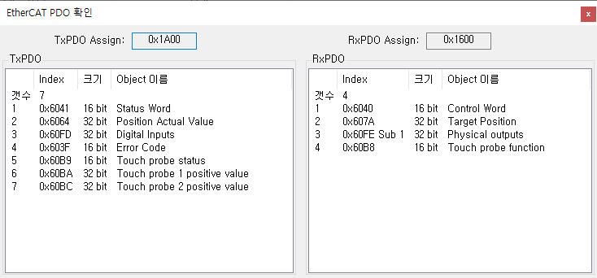

# EtherCAT PDO 확인

{width=500}

EtherCAT PDO 확인 화면에서 현재 제품에 설정된 EtherCAT 통신의 PDO Mapping 을 확인할 수 있습니다.

화면의 값들은 EtherCAT Master 를 통해 설정되며, EtherCAT 통신 상태(State Machine)가 PRE-OP 에서 SAFE-OP 로 변경될 때 설정됩니다. 
즉, 통신 상태가 OP 혹은 SAFE-OP 인 경우에만 유효한 데이터입니다.
