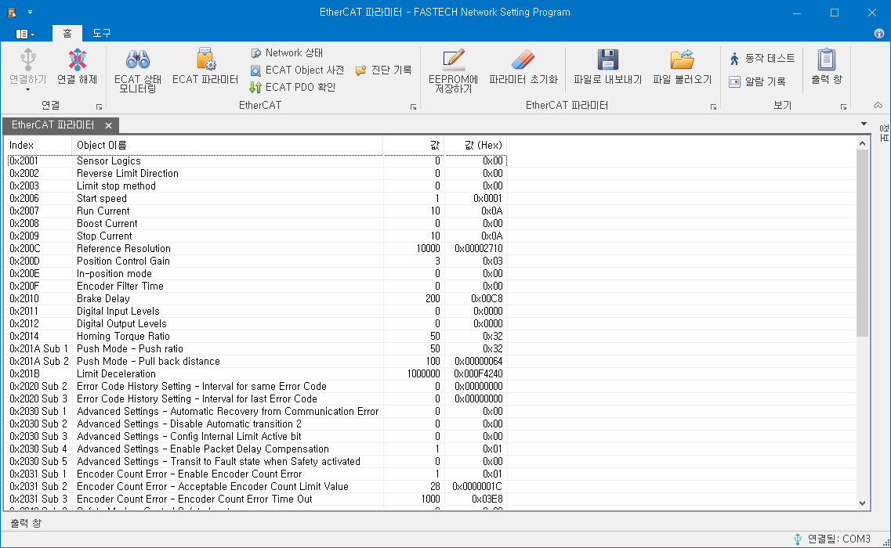
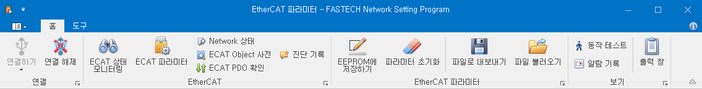

# EtherCAT 파라미터

{width=600}

EtherCAT 파라미터 화면에서 제품의 파라미터를 확인하고 설정할 수 있습니다

| Column      | 설명                                                                                            |
| ----------- | ----------------------------------------------------------------------------------------------- |
| Index       | 해당 Object 의 Index 를 표시합니다. Sub-index 가 0 이 아닐 경우 Sub-index 값도 같이 표시합니다. |
| Object 이름 | 해당 Object 의 이름을 표시합니다.                                                               |
| 값          | 해당 Object 의 값을 10 진수로 표시합니다.                                                       |
| 값(HEX)     | 해당 Object 의 값을 16 진수로 표시합니다.                                                       |

EtherCAT 파라미터들은 값을 수정하는 즉시 적용됩니다. 
EtherCAT 파라미터의 값은 EtherCAT 통신 상태 (State Machine)와는 상관없이 언제든지 확인 및 수정할 수 있습니다.

수정된 파라미터들의 값은 제품의 전원이 꺼지면 이전 값으로 복원됩니다. 
파라미터들을 변경된 값으로 계속 사용하고자 한다면, EEPROM 에 저장하기를 클릭하여 현재의 값들을 제품 내부에 저장하십시오.

파라미터 초기화를 클릭하면 저장된 모든 파라미터들을 공장 초기값으로 되돌릴 수 있습니다.

## EtherCAT 파라미터 매뉴

{width=600}

EtherCAT 파라미터 창이 활성화/Focus 되면 프로그램 상단 메뉴에 EtherCAT 파라미터 메뉴가 추가됩니다.
EtherCAT 파라미터 메뉴는 다른 창이 활성화 되면 사라집니다.

|                      ICON                       | 이름               | 설명                                                                                                                                                                                                                                                                   |
| :---------------------------------------------: | ------------------ | ---------------------------------------------------------------------------------------------------------------------------------------------------------------------------------------------------------------------------------------------------------------------- |
|  | EEPROM 에 저장하기 | 현재의 파라미터들을 제품의 EEPROM 에 저장합니다. 파라미터들을 저장하면 파라미터의 값들은 제품의 전원이 꺼지더라도 유지됩니다.                                                                                                                                          |
|                       | 파라미터 초기화    | 제품의 파라미터 값들을 모두 공장 초기화 값으로 초기화 시킵니다. 초기화 과정을 완료하기 위해서는 파라미터 초기화를 클릭 후 제품의 전원을 꺼야 합니다. 파라미터 초기화 명령 후, 제품의 전원을 끄기 전에 EEPROM 에 저장하기를 실행하게 되면 파라미터 초기화는 취소됩니다. |
|                        | 파일로 내보내기    | 파라미터 값들을 파일로 내보냅니다.                                                                                                                                                                                                                                     |
|                    | 파일 불러오기      | 파라미터 파일을 읽어옵니다. 파라미터 파일을 통해 변경된 파라미터들은 EEPROM 에 저장되지 않은 상태입니다. 해당 파라미터 값들을 유지하기 원할 경우에는 EEPROM 에 저장하기를 실행하시기 바랍니다.                                                                         |
