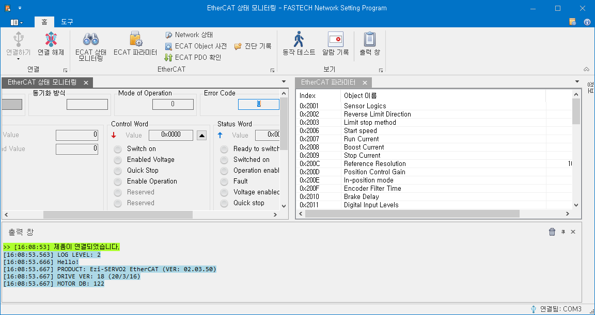
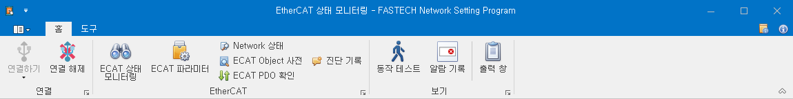
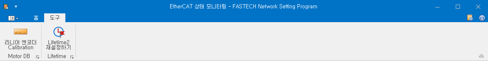
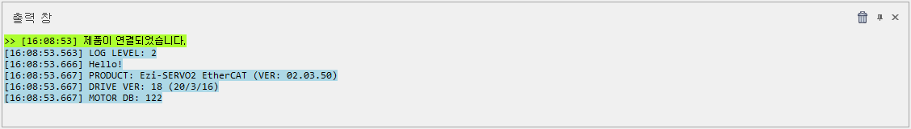
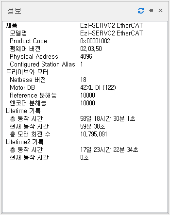

# 메인 화면

{width=600}

프로그램의 기본 화면입니다. 상단에는 지원하는 화면을 표시할 수 있는 메뉴가 존재하며, 아래에는 제품과의 통신 중, 제품 동작 중에 중요한 Log 메시지가 출력되는 출력 창이 있습니다.

## 메뉴 - 홈

{width=600}

|                       ICON                       | 이름               | 설명                                                                                                |
| :----------------------------------------------: | ------------------ | --------------------------------------------------------------------------------------------------- |
|                       | 연결하기           | 제품의 USB 통신 연결을 시도합니다.                                                                  |
|                    | 연결 해제          | 현재 연결된 USB 통신을 해제합니다.                                                                  |
|                         | ECAT 상태 모니터링 | EtherCAT Master와 주고 받는 데이터를 확인할 수 있는 EtherCAT 상태 모니터링 창을 표시합니다.         |
|                        | ECAT 파라미터      | 제품의 파라미터를 확인하고 설정할 수 있는 EtherCAT 파라미터 창을 표시합니다.                        |
|               | Network 상태       | 제품의 EtherCAT 통신 상태를 확인할 수 있는 NETWORK 상태 창을 표시합니다.                            |
|  | ECAT Object 사전   | 제품이 가지고 있는 EtherCAT Object 목록과 값을 확인할 수 있는 EtherCAT OBJECT 사전 창을 표시합니다. |
|                         | ECAT PDO 확인      | 제품의 현재 설정된 PDO Mapping을 확인할 수 있는 EtherCAT PDO 확인 창을 표시합니다.                  |
|                | 진단 기록          | 제품에서 발생한 중요 Event들을 확인할 수 있는 진단 기록 창을 표시합니다.                            |
|                      | 동작 테스트        | EtherCAT Master를 통하지 않고, 제품을 동작 시킬 수 있는 동작 테스트 창을 표시합니다.                |
|               | 알람 기록          | 제품에서 지금까지 발생한 알람의 기록을 확인할 수 있는 알람 기록 창을 표시합니다.                    |
|                    | 출력 창            | 제품에서 발생하는 Log 메시지를 확인할 수 있는 출력 창을 표시합니다.                                 |

## 메뉴 - 도구

{width=600}

|                 ICON                 | 이름                      | 설명                                                                                                         |
| :----------------------------------: | ------------------------- | ------------------------------------------------------------------------------------------------------------ |
|  | 리니어 엔코더 Calibration | 리니어 엔코더를 Calibration할 수 있습니다. 단, 리니어 엔코더를 지원하는 제품일 경우 이 메뉴가 활성화 됩니다. |
|         | Lifetime2 재설정하기      | Object 0x2025 – Lifetime Record의 sub index 7 ~ 9의 LTR2 항목들을 초기화 하는 기능입니다.                    |

## 출력 창

{width=600}

출력 창에서 그리고 제품이 동작하는 중에 발생하는 중요한 Log 메시지를 확인할 수 있습니다.

## 정보 창

{align=right}

정보 창에 현재 연결된 제품의 정보가 표시됩니다.

| 항목                      | 설명                                                                                                   |
| ------------------------- | ------------------------------------------------------------------------------------------------------ |
| 제품	연결된 제품의 제품명 |
| 모델명                    | Object 0x1008 – Product Name의 값.                                                                     |
| Product Code              | Object 0x10018 sub index 2 – Product Code의 값.                                                        |
| 펌웨어 버전               | 제품 통신부의 F/W 버전.  Object 0x100A – Software Version의 값.                                     |
| Physical Address          | EtherCAT Master가 할당한 물리 주소.                                                                    |
| Configured Station Alias  | 설정된 Configured Station Alias 값.                                                                    |
| Netbase 버전              | 드라이브 제어부의 F/W 버전.                                                                            |
| Motor DB                  | 입력된 Motor DB의 번호.   Object 0x200A – Motor Number의 값.                                        |
| Reference 분해능          | 설정된 Reference 분해능. 모터 1회전에 필요한 Pulse 수.   Object 0x200C – Reference Resolution의 값. |
| 엔코더 분해능             | Object 0x2005 – Encoder Resolution의 값.                                                               |
| Lifetime 기록             | Lifetime의 기록.                                                                                       |
| Lifetime2 기록            | Lifetime2의 기록.                                                                                      |
