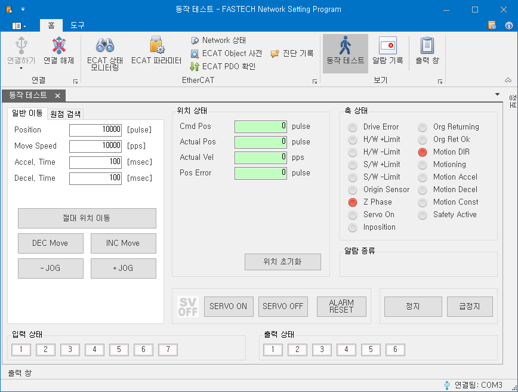

# 동작 테스트

{width=600}

동작 테스트 화면에서는 USB 통신을 통해 제품의 현재 상태를 확인하고 모터를 동작 시킬 수 있습니다.

EtherCAT 통신 상태(State Machine)가 OP 혹은 SAFE-OP인 상태에서는 동작 테스트 화면에서 어떤 명령도 실행할 수 없습니다. 제품이 그 외의 통신 상태일 때 동작 테스트 화면을 이용하시기 바랍니다.

동작 테스트 화면에서 명령을 호출하거나 값을 변경한 경우, 일부 EtherCAT Object 값들도 변경될 수 있습니다. 이와 같이 사용자가 의도하지 않은 EtherCAT Object의 값 변경은 이 후 제품의 운용에서 다른 결과를 유발할 수 있습니다. 동작 테스트 화면을 통해 제품을 테스트 한 후 EtherCAT Master를 통해 제어하기 전에 제품의 전원을 껏다 켜 주시기를 추천 드립니다.
