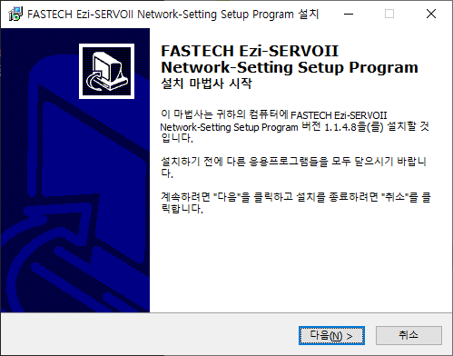
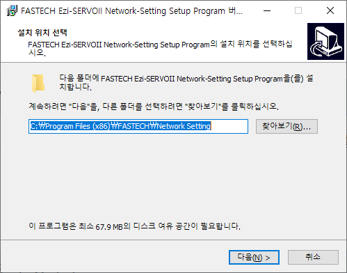
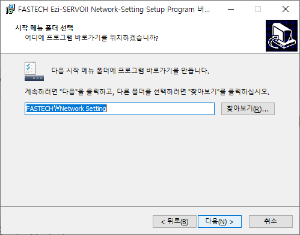
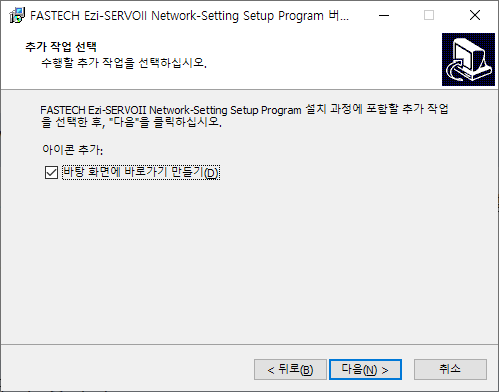
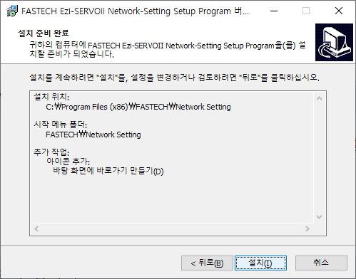
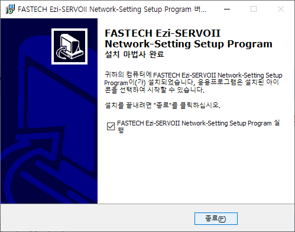

# 설치하기

## 프로그램 설치하기

|                                                                                 |                                  |
| ------------------------------------------------------------------------------- | -------------------------------: |
| 1. Network Setting Progra을 실행합니다.   다음을 클릭합니다.              |  |
| 2. 설치할 폴더를 선택합니다.   다음을 클릭합니다.                         |  |
| 3. 시작 메뉴 폴더를 선택합니다.   다음을 클릭합니다.                      |  |
| 4. 바탕화면에 바로가기를 생성할지 선택합니다.   다음을 클릭합니다.        |  |
| 5. 설치 준비가 끝났습니다.   설치할 경로 등을 확인하고 설치를 클릭합니다. |  |
| 6. 설치가 완료되었습니다.                                                       |  |
