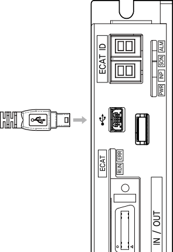
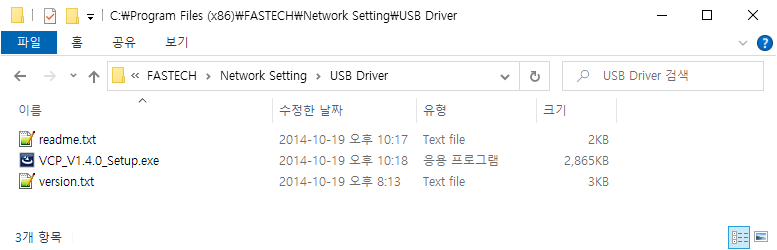
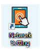
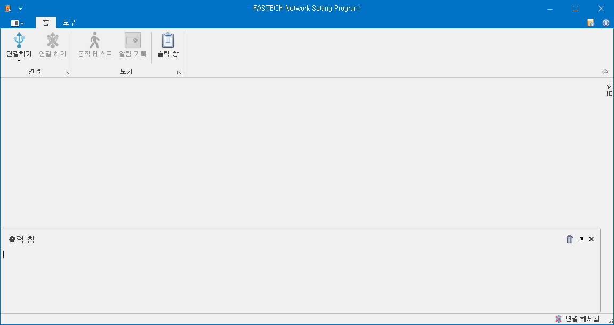
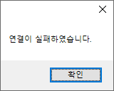
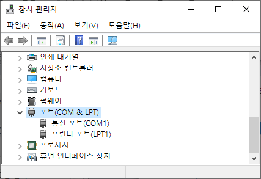
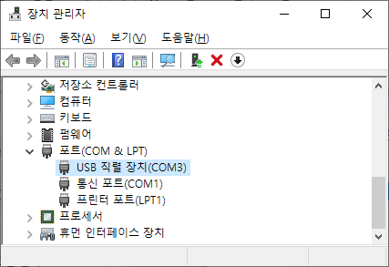

# 프로그램 실행하기

## USB 케이블 연결하기

{width="120" align=right}

제품에 전원을 인가합니다. 그리고, 제품의 USB 커넥터에 USB 케이블을 연결하고 반대편을 PC 에 연결합니다.

케이블은 표준 USB 2.0 Mini-B (5pin) 케이블을 사용하십시오.

## USB Device Driver 설치하기

USB Device Driver 가 설치되지 않았다면, 제품의 USB 장치를 인식하지 못할 수 있습니다.
제품의 USB 장치가 인식되지 않는다면, 프로그램이 설치된 Folder 안에 있는 USB Driver 를 설치하시기 바랍니다.

{width="600"}

## 프로그램 실행하기

{align=right}

Network Setting 아이콘을 클릭하여 프로그램을 실행합니다.

## Connect 하기

연결을 시도하기 전에 USB 케이블이 제품에 연결되어 있는지, 제품의 전원이 인가되어 있는지 확인하시기 바랍니다.

{width="600"}

메인 메뉴에 연결하기를 클릭하여 연결을 시도합니다. 프로그램이 PC 에 있는 모든 COM port 를 자동으로 연결하여 제품을 찾습니다.

만약 2 개 이상의 제품이 연결되어 있거나 다른 COM port 로 인하여 연결이 실패할 경우, 연결하기 아래의 화살표를 눌러 특정 COM port 를 선택하여 연결할 수 있습니다.

성공적으로 연결이 되면 출력 창에 제품이 연결되었습니다 라는 메시지가 출력되며 EtherCAT 상태 모니터링 창과 EtherCAT 파라미터 창이 표시됩니다.

{align=right}

연결이 실패하면 `연결이 실패하였습니다`라는 메시지박스가 표시됩니다.

연결이 실패한다면 다음을 확인해 보시기 바랍니다.

1. 제품의 전원이 인가되어 있는지 확인하십시오.
2. 제품에 USB 케이블이 연결되어 있고, 반대편이 PC 에 연결되어 있는지 확인하십시오.
3. Network Setting 프로그램이 이미 실행되고 있고 동일한 COM Port 에 연결된 상태가 아닌지 확인하십시오.
4. 연결하기 아래의 화살표를 눌러 제품이 연결된 COM Port 를 직접 선택해서 연결을 시도해 보십시오.

## COM Port 번호 확인하기

PC 에 두 개 이상의 제품이 USB 를 통해 연결되어 있거나, 임의의 USB-to-Serial 제품으로 인하여 Network Setting 프로그램의 연결하기가 실패할 수 있습니다. 이 경우에는 하나의 COM Port 를 선택하여 연결할 수 있습니다. 그러기 위해서는 제품이 연결된 COM Port 의 번호를 알 필요가 있습니다.

제품에 USB 를 연결하였을 때 연결된 COM Port 번호는 윈도우의 장치 관리자를 통해서 확인할 수 있습니다. 제품에 USB 를 연결하였을 때 포트(COM & LP) 아래에 새로 추가되는 COM 장치가 제품의 COM Port 임을 확인할 수 있습니다. 단, COM 장치의 이름은 USB 드라이브에 따라 다를 수 있습니다.

|  |  |
| :---------------------------------------: | :---------------------------------------: |
|                USB 연결 전                |                USB 연결 후                |
